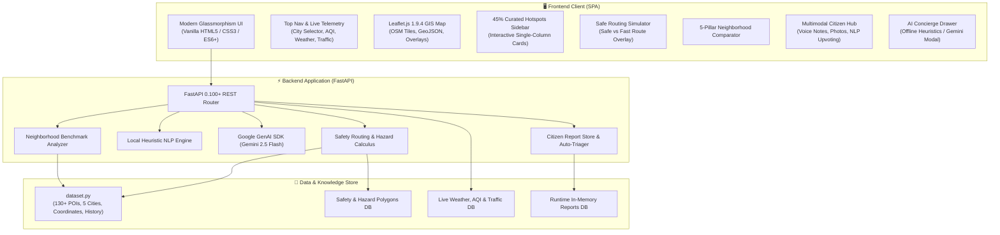

<div align="center">

# 🏙️ CityVibe — AI Urban Navigator & Safety Intelligence

> **Next-Generation Smart Exploration & Geospatial Safety Intelligence Engine for Indian Metros**

[](https://fastapi.tiangolo.com/)
[](https://www.python.org/)
[](https://leafletjs.com/)
[](https://www.openstreetmap.org/)
[](https://deepmind.google/technologies/gemini/)
[](LICENSE)

[🌐 Live Demo App (Local)](#-quick-start) • [📖 API Documentation](#-api-specification) • [🛡️ Safety Pillars](#-core-capabilities--pillars) • [🏗️ Architecture](#-system-architecture) • [🧪 Test Suite](#-automated-testing--validation)

---

</div>

## 📌 Executive Summary

**CityVibe** is an intelligent urban navigation and geospatial exploration platform built to empower citizens, commuters, tourists, and students across India's largest metropolitan regions. While conventional mapping aggregators prioritize the shortest physical distance, CityVibe balances **urban discovery with personal safety, nighttime street illumination, pedestrian density, accident risk zones, and neighborhood transparency**.

Powered by a high-throughput **FastAPI** backend, interactive **Leaflet GIS** cartography, and a **zero-config dual-mode AI Concierge** (instant local heuristic NLP + optional Google Gemini 2.5 Flash), CityVibe provides curated insights for **Pune, Mumbai, Delhi, Bengaluru, and Jaipur**.

---

## 🎯 The Urban Challenges We Solve

| Challenge | Conventional Navigation Apps | CityVibe Solution |
| :--- | :--- | :--- |
| **Nighttime & Women's Safety** | Routes through unlit, isolated alleys to shave off 2 minutes. | **Safety-Weighted Routing** dynamically steers users along well-lit, CCTV-monitored arterial boulevards with high pedestrian footfall. |
| **Hazard & Risk Awareness** | Lacks hyper-local context on waterlogging, potholes, and accident hotspots. | **Geospatial Hazard Layers** map active risk zones with severity badges and actionable safety precautions. |
| **Tourist & Cultural Depth** | Generic 5-star ratings without historical or cultural context. | **130+ Curated Places** with authentic architectural history, best visiting hours, cleanliness metrics, and cost levels. |
| **Neighborhood Relocation** | Blind comparisons based solely on rent or anecdotal hearsay. | **5-Pillar Benchmark Matrix** evaluates neighborhoods across Safety, Cleanliness, Affordability, Ratings, and Transit. |
| **Crowdsourced Incident Reporting** | Complex municipal grievance portals with zero immediate feedback. | **Multimodal Citizen Hub** with text, simulated voice notes, photo tagging, live upvoting, and automated NLP severity triage. |
| **Connectivity Outages** | Cloud AI assistants fail in subterranean transit or crowded alleys. | **Hybrid Offline AI Concierge** delivers instant responses with zero API key dependencies and zero cloud latency. |

---

## ✨ Core Capabilities & Pillars

### 1. 🗺️ Interactive Exploration Dashboard
- **Balanced Split Layout**: 45% responsive hotspot list and 55% high-performance Leaflet map, ensuring optimal visual harmony on desktop, tablet, and mobile.
- **Rich Landmark Cards**: High-definition imagery, star ratings, cleanliness scores, safety ratings, price level, operational hours, and category chips.
- **Multi-City Pan-India Dataset**: Instant filtering across **Pune**, **Mumbai**, **Delhi**, **Bengaluru**, and **Jaipur** spanning 5 curated categories:
  - 🏛️ *Heritage & Historic Monuments*
  - 🍢 *Food Streets & Culinary Katas*
  - 🛍️ *Fashion Corridors & Traditional Bazaars*
  - 🎨 *Art, Culture & Public Spaces*
  - 🏨 *Hotels, Stays & Heritage Retreats*

### 2. 🛡️ Safety-First Route Simulator ("Vibe Routing")
- **Dual-Trajectory Comparison**: Computes two distinct navigational options:
  - 🟢 **Safe Boulevard Route**: Maximizes street lighting, CCTV surveillance, and pedestrian activity with quantified safety scores (e.g., 9.2/10).
  - 🟠 **Direct Arterial Route**: The raw, fastest shortcut highlighting potential hazard intersections.
- **Interactive Route Map Overlay**: Visualizes polylines directly on Leaflet with start/destination pinpoints and comparative time/distance delta.
- **Turn-by-Turn Export**: 1-click **Open in Google Maps** integration for live on-the-road navigation.

### 3. ⚠️ Dynamic Safety & Hazard Zones
- Real-time GIS polygon and circular overlays depicting:
  - 🔴 *Accident-Prone Intersections*
  - 🟡 *Waterlogging & Monsoon Risks*
  - 🟣 *Dim-Lit Night Corridors*
  - 🟠 *Construction Bottlenecks & Metro Works*
- Interactive popup overlays providing safety tips and municipal helplines.

### 4. ⚖️ 5-Pillar Neighborhood Benchmark Matrix
- Side-by-side comparative analytics evaluating two neighborhoods simultaneously across:
  - 🛡️ **Safety Index** (1–10)
  - 🧹 **Cleanliness & Sanitation** (1–10)
  - 💰 **Affordability Level** (1–10)
  - ⭐ **Community & Culture Rating** (1–5)
  - 🚇 **Public Transit Accessibility** (1–10)
- Automated algorithm calculates category winners and awards an overall comparative crown.

### 5. 📢 Multimodal Citizen Reporting & Verification Hub
- Citizen-powered incident reporting featuring:
  - 📝 **Incident Summaries & Detailed Observations**
  - 🎙️ **Simulated Audio Voice Note Recorder** (waveform visualizer)
  - 📷 **Photo URL attachments**
  - 🏷️ **Categorization**: *Safety Hazard*, *Traffic Congestion*, *Cleanliness*, or *Cultural Street Vibe*
- **Automated NLP Triage**: Classifies incident severity into *Low*, *Medium*, or *High* based on heuristic keywords.
- **Community Upvoting Engine**: Real-time upvoting to push high-priority community alerts to the top.

### 6. ⚡ Dual-Mode AI Urban Concierge
- **Offline Heuristic NLP Engine**: Pre-loaded knowledge base answering queries on safety tips, food walks, historical backgrounds, and transit recommendations with **zero setup and zero API key required**.
- **Optional Gemini 2.5 Flash Connector**: Enter a Google Gemini API key via the modal to unlock cloud-scale generative reasoning and customized travel itineraries.

### 7. 🌓 Adaptive Glassmorphism & Live Telemetry
- **Live Environmental Sensors**: Real-time top navigation status bar showing Temperature (°C), Air Quality Index (AQI), and Traffic Congestion index per selected city.
- **Seamless Theme Switcher**: Toggle between ultra-sleek Dark Cyberpunk glassmorphism and crisp Light Mode with persistent state.

---

## 🏗️ System Architecture



---

## 🛠️ Technology Stack

| Layer | Technologies Used | Key Highlights |
| :--- | :--- | :--- |
| **Backend** | Python 3.10+, FastAPI, Uvicorn, Pydantic | High-performance asynchronous REST endpoints with automatic OpenAPI schema generation. |
| **Frontend** | Vanilla HTML5, Modern CSS3, JavaScript (ES6+) | Zero heavy bundlers, CSS variables, glassmorphism design system, responsive flex/grid layouts. |
| **Geospatial & Maps** | Leaflet.js 1.9.4, OpenStreetMap (OSM) Tiles | Lightweight browser mapping with custom SVG markers, polygon risk overlays, and polyline routing. |
| **AI & NLP** | Offline Rule & Heuristic Synthesis + Google Gemini API (`google-genai`) | Dual-mode intelligence: instant offline zero-key fallback with optional Gemini 2.5 Flash integration. |
| **Testing** | Python `unittest` / `urllib` Test Runner (`test_runner.py`) | 8 automated test suites verifying all functional endpoints and edge cases. |

---

## 🚀 Quick Start & Installation

### Prerequisites
- **Python 3.10 or higher** installed on your system.
- Git installed.

### 1. Clone the Repository
```bash
git clone https://github.com/ashutosh3337/CityVibe.git
cd CityVibe
```

### 2. Set Up a Virtual Environment (Recommended)

**On Windows (PowerShell):**
```powershell
python -m venv venv
.\venv\Scripts\Activate.ps1
```

**On macOS / Linux:**
```bash
python3 -m venv venv
source venv/bin/activate
```

### 3. Install Dependencies
```bash
pip install -r requirements.txt
```

### 4. Run the Development Server
```bash
python -m uvicorn app:app --host 127.0.0.1 --port 8000 --reload
```

### 5. Access the Application
- 🌐 **Web Dashboard**: [http://127.0.0.1:8000](http://127.0.0.1:8000)
- 📚 **Interactive Swagger API Docs**: [http://127.0.0.1:8000/docs](http://127.0.0.1:8000/docs)
- 📖 **ReDoc API Documentation**: [http://127.0.0.1:8000/redoc](http://127.0.0.1:8000/redoc)

---

## 🧪 Automated Testing & Validation

CityVibe includes a comprehensive end-to-end technical verification script that validates all 6 hackathon pillars, edge cases, and safety calculations:

```bash
python test_runner.py
```

### Test Suite Overview:
```text
========================================
🚀 Starting CityVibe Technical Test Suite
========================================
✅ [1/8] Health Check & Diagnostics API: PASSED
✅ [2/8] POI Exploration & Filtering: PASSED
✅ [3/8] Safety & Hazard Zones Intelligence: PASSED
✅ [4/8] Best vs. Worst 5-Pillar Comparator: PASSED
✅ [5/8] Safe vs. Fast Route Simulator: PASSED
✅ [6/8] Multimodal Citizen Report & NLP Triage: PASSED
✅ [7/8] AI Concierge & Offline/Online Synthesis: PASSED
✅ [8/8] Edge Cases & Input Validation: PASSED
========================================
🎉 ALL 8 TEST SUITES COMPLETED SUCCESSFULLY!
========================================
```

---

## 📖 API Specification

| Method | Endpoint | Description | Sample Query / Payload |
| :---: | :--- | :--- | :--- |
| `GET` | `/api/health` | System diagnostics, active POI count, and model status. | — |
| `GET` | `/api/pois` | List curated spots with optional city, category, or neighborhood filters. | `?city=pune&category=food` |
| `GET` | `/api/safety-zones` | Retrieve all geo-hazard zones (waterlogging, dim lighting, accidents). | `?city=pune` |
| `GET` | `/api/live-status` | Current environmental telemetry (Weather, Temp, AQI, Congestion). | `?city=pune` |
| `GET` | `/api/benchmarks` | Retrieve all neighborhood score records for a city. | `?city=pune` |
| `GET` | `/api/benchmarks/compare` | Evaluate two neighborhoods side-by-side across the 5 pillars. | `?areaA=Deccan+%26+FC+Road&areaB=Koregaon+Park` |
| `POST` | `/api/route-plan` | Compute Safe Boulevard Route vs. Direct Arterial Route with scores. | `{"originPoiId": "poi-1", "destPoiId": "poi-4", "mode": "balanced"}` |
| `GET` | `/api/reports` | Retrieve verified live crowdsourced citizen safety alerts. | — |
| `POST` | `/api/reports` | Submit a new citizen incident with multimodal data (text/voice/photo). | `{"category": "safety", "neighborhood": "...", "title": "..."}` |
| `POST` | `/api/reports/{id}/upvote` | Increment community upvotes for a verified incident. | — |
| `POST` | `/api/concierge` | Query the AI Urban Concierge (Offline NLP heuristic or Gemini). | `{"prompt": "Safest night areas in Pune?"}` |
| `POST` | `/api/configure-key` | Hot-swap or initialize a Google Gemini API Key at runtime. | `{"apiKey": "AIzaSy..."}` |

---

## 📂 Project Directory Structure

```text
CityVibe/
│
├── app.py                   # FastAPI REST API server, routing logic & endpoints
├── dataset.py               # 130+ Curated POIs, hazard zones, benchmarks & telemetry
├── test_runner.py           # 8-suite automated technical validation test
├── requirements.txt         # Core dependencies (fastapi, uvicorn, pydantic, google-genai)
├── README.md                # Comprehensive project documentation
├── vercel.json              # Serverless deployment configuration for Vercel
│
├── api/
│   └── index.py             # ASGI entry point for serverless environments
│
└── static/
    ├── index.html           # Semantic single-page application structure
    ├── style.css            # Responsive glassmorphism styling & design system
    └── app.js               # Leaflet GIS, route computation, telemetry & AI logic
```

---

## 🏙️ Supported Metros & Curated Coverage

CityVibe features rich, authentic data crafted specifically for Indian urban dynamics:

| City | Highlights & Distinctive Character | Curated Spots | Key Hotspots |
| :--- | :--- | :---: | :--- |
| **Pune** | Cultural capital of Maharashtra; vibrant student culture and hill breeze. | 30+ | Shaniwar Wada, FC Road, Koregaon Park, Sinhagad Fort, Aga Khan Palace |
| **Mumbai** | Maximum City; coastal promenades, bustling colonial architecture, and street food. | 25+ | Gateway of India, Marine Drive, Bandra Bandstand, Colaba Causeway, Crawford Market |
| **Delhi NCR** | Historic Mughal heritage, wide avenues, lively markets, and culinary heritage. | 25+ | India Gate, Chandni Chowk, Hauz Khas Village, Connaught Place, Qutub Minar |
| **Bengaluru** | Garden City & Silicon Valley; microbreweries, leafy lanes, and vibrant tech culture. | 25+ | Lalbagh Botanical Garden, Church Street, Indiranagar, Cubbon Park, MG Road |
| **Jaipur** | The Pink City; royal Rajput fortresses, jewel bazaars, and heritage culinary spots. | 25+ | Hawa Mahal, Amer Fort, Johari Bazaar, City Palace, Nahargarh Fort |

---

## 🔮 Roadmap & Future Horizons

- [ ] **Real-time SOS Escort**: One-tap emergency broadcast dispatching live coordinates to nearest emergency contacts and police stations.
- [ ] **Crowdsourced Night Illumination Heatmap**: Commuter-rated lux street lighting maps updating in real-time.
- [ ] **Live Public Transit Schedules**: Direct integration with Pune Metro, Mumbai Metro, and Delhi Metro APIs for multimodal transit.
- [ ] **Multi-Language Audio Walk Guides**: Native Marathi, Hindi, Kannada, and English narration for historical heritage sites.
- [ ] **Offline PWA Support**: Full Service Worker caching enabling map exploration even during mobile cellular blackouts.

---

## 📄 License & Attribution

This project is open-source under the **[MIT License](LICENSE)**.

Built with ❤️ for urban commuters, solo travelers, and students across India.